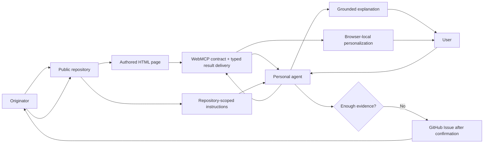

# Explain Him – overview

## Short formula

**The Originator publishes canonical meaning once; a user's personal agent explains it at the right depth; WebMCP turns the authored page into a shared human–agent surface where both can inspect and personalize the same live explanation without rewriting the original.**

## Required components

1. **Idea repository** – storage, versioning, public address, and access model.
2. **Authored page** – a visual explanation prepared by the Originator.
3. **Bootstrap** – `README.md`, `AGENTS.md`, the portable skill, and the manifest.
4. **Knowledge and resolutions** – deeper context, statuses, provenance, and accepted clarifications.
5. **WebMCP Site Tools** – repository/skill/target discovery plus safe typed add/replace/update/remove/focus operations.
6. **User's personal agent** – the primary conversational and reasoning interface.
7. **GitHub Issues** – the confirmed feedback loop for new questions.

A separate hosted Explain Him Pro runtime is not required for this model.

## Ownership principle

> The Originator controls canonical meaning. The user controls the question and depth. The personal agent controls the path of a specific explanation within grounded sources. WebMCP controls only the typed interaction contract with the current page.

## Status

- Public repository, authored page, knowledge, instructions, and current WebMCP implementation are `current` artifacts of the public demo.
- Browser-local workspace/personalization is `demo-only` product behavior.
- Cross-device/private hosted capabilities belong to Explain Him Pro.
- Direct Site Tool support depends on the browser/agent host.

See [[03-grounding-and-status]], [[04-question-loop]], [[06-browser-local-workspace]], and [[../resolutions/2026-08-30-webmcp-challenge-surface]].
