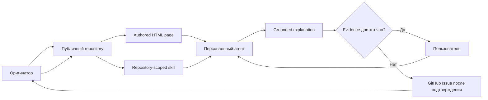

# Explain Him — общая модель

## Короткая формула

**Репозиторий Оригинатора хранит authored explanation и versioned materials; repository-scoped skill превращает их в способность персонального агента пользователя; GitHub Issues возвращают Оригинатору вопросы, на которые evidence ещё недостаточно.**

## Обязательные компоненты

1. **Репозиторий идеи** — хранение, versioning, публичный адрес и модель доступа.
2. **Authored page** — подготовленное Оригинатором визуальное объяснение.
3. **Bootstrap** — `README.md`, `AGENTS.md` и manifest.
4. **Knowledge и resolutions** — контекст, статусы, provenance и принятые уточнения.
5. **Repository-scoped skill** — процедура поиска, grounding, визуализации и эскалации.
6. **Персональный агент пользователя** — основной разговорный интерфейс.
7. **GitHub Issues** — feedback loop для новых вопросов.

Отдельный hosted runtime Explain Him Pro для этой модели не обязателен.

## Главный принцип владения

> Оригинатор управляет каноническим смыслом. Пользователь управляет вопросом и глубиной. Персональный агент управляет траекторией конкретного объяснения в пределах подтверждённых источников.

## Статус

- Public repository, page, knowledge и skill — `current` artifacts.
- Browser-local workspace и WebMCP tools — `demo-only` implementation.
- Native cross-browser `registerSkill()` compatibility — `target`/`open` в зависимости от host.

См. [[03-grounding-and-status]], [[04-question-loop]] и [[06-browser-local-workspace]].
