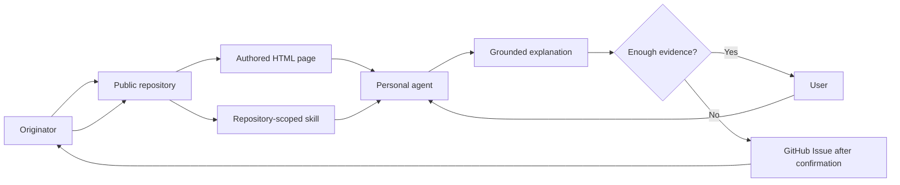

# Explain Him — overview

## Short formula

**The Originator's repository stores the authored explanation and versioned materials; a repository-scoped skill turns them into a capability of the user's personal agent; GitHub Issues return questions to the Originator when the available evidence is still insufficient.**

## Required components

1. **Idea repository** — storage, versioning, public address, and access model.
2. **Authored page** — a visual explanation prepared by the Originator.
3. **Bootstrap** — `README.md`, `AGENTS.md`, and the manifest.
4. **Knowledge and resolutions** — context, statuses, provenance, and accepted clarifications.
5. **Repository-scoped skill** — the procedure for discovery, grounding, visualization, and escalation.
6. **User's personal agent** — the primary conversational interface.
7. **GitHub Issues** — the feedback loop for new questions.

A separate hosted Explain Him Pro runtime is not required for this model.

## Ownership principle

> The Originator controls canonical meaning. The user controls the question and depth. The personal agent controls the path of a specific explanation within grounded sources.

## Status

- Public repository, page, knowledge, and skill are `current` artifacts.
- Browser-local workspace and WebMCP tools are a `demo-only` implementation.
- Native cross-browser `registerSkill()` compatibility is `target`/`open` depending on the host.

See [[03-grounding-and-status]], [[04-question-loop]], and [[06-browser-local-workspace]].
